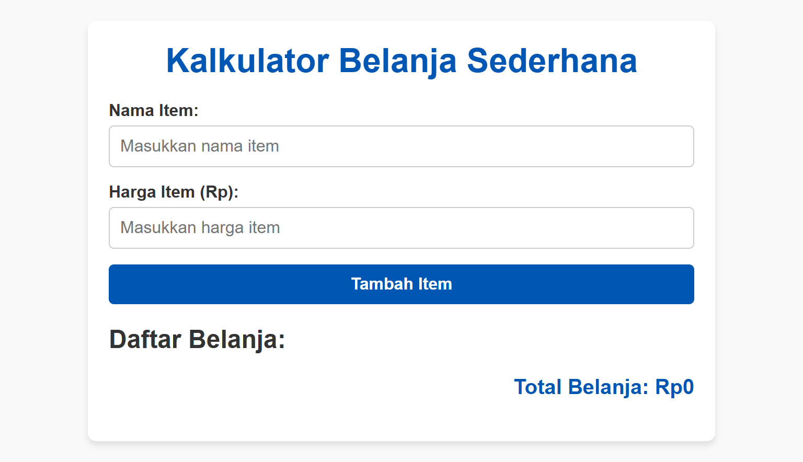

# Kalkulator Belanja Sederhana

Program ini adalah aplikasi sederhana yang berfungsi untuk menambahkan item belanja, menghitung total belanja, dan menampilkan daftar item belanja di layar. Aplikasi ini dibangun menggunakan **HTML**, **CSS**, dan **JavaScript**.

## Fitur Program

1. **Input Data**:

    - Pengguna dapat memasukkan nama item dan harga item.
    - Validasi input memastikan data yang dimasukkan valid.

2. **Tipe Data**:

    - Menggunakan tipe data **array**, **number**, dan **string**.

3. **Kontrol Program**:

    - Menggunakan struktur **percabangan** untuk validasi input.
    - Menggunakan struktur **perulangan** untuk menampilkan daftar belanja.
    - Fungsi digunakan untuk modularisasi kode.

4. **UI/UX Modern**:
    - Desain sederhana namun elegan menggunakan **CSS**.

## Teknologi yang Digunakan

-   **HTML** untuk struktur halaman.
-   **CSS** untuk mempercantik tampilan.
-   **JavaScript** untuk logika aplikasi.

## Cara Menjalankan

1. Salin kode program ke dalam file bernama `index.html`.
2. Buka file tersebut di browser.
3. Masukkan nama item dan harga item.
4. Klik tombol "Tambah Item" untuk menambahkan ke daftar belanja.
5. Total belanja akan otomatis diperbarui dan ditampilkan.

## Screenshots

