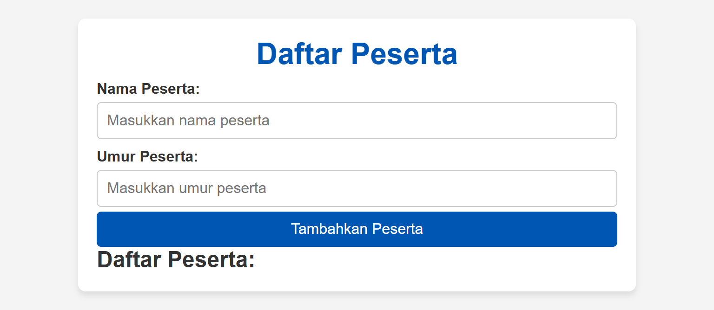

# Program Daftar Peserta

Program ini adalah aplikasi sederhana untuk mencatat dan menampilkan daftar peserta. Pengguna dapat memasukkan nama dan umur peserta, dan aplikasi akan menampilkan daftar peserta beserta kategori umur (anak-anak, dewasa, lansia).

## Fitur Program

1. **Input Data**:

    - Nama peserta.
    - Umur peserta (dalam tahun).

2. **Baca dan Tulis Data**:

    - Data peserta yang dimasukkan oleh pengguna ditampilkan dalam daftar di layar.

3. **Struktur Kontrol**:

    - **Percabangan** digunakan untuk:
        - Validasi input.
        - Menentukan kategori umur berdasarkan data yang dimasukkan.
    - **Perulangan** digunakan untuk:
        - Menampilkan daftar peserta.

4. **Kategori Umur**:
    - Anak-anak: Umur < 18 tahun.
    - Dewasa: Umur 18-59 tahun.
    - Lansia: Umur ≥ 60 tahun.

## Teknologi yang Digunakan

-   **HTML** untuk struktur halaman.
-   **CSS** untuk mempercantik tampilan.
-   **JavaScript** untuk logika aplikasi.

## Cara Menjalankan

1. Salin kode program ke dalam file bernama `index.html`.
2. Buka file tersebut di browser.
3. Masukkan nama peserta dan umur peserta.
4. Klik tombol "Tambahkan Peserta" untuk menambahkan ke daftar peserta.
5. Daftar peserta lengkap dengan kategori umur akan ditampilkan.

## Screenshots

