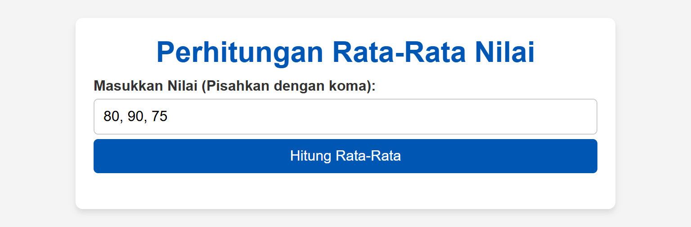
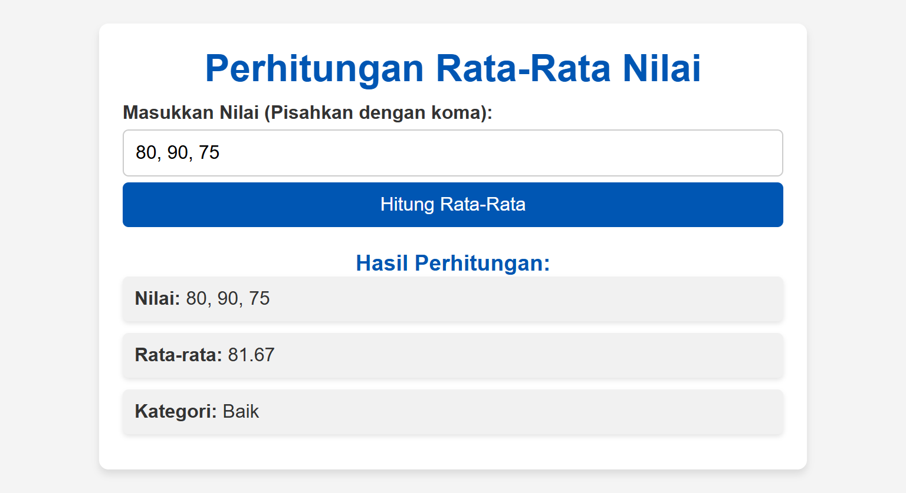

# Perhitungan Rata-Rata Nilai Siswa

Program ini adalah aplikasi sederhana untuk menghitung rata-rata nilai siswa dan menentukan kategori berdasarkan rata-rata nilai tersebut. Program ini memanfaatkan prosedur dan fungsi sesuai standar penulisan program.

## Fitur Program

1. **Input Nilai**:

    - Pengguna dapat memasukkan daftar nilai dalam format angka, dipisahkan oleh koma.
    - Contoh input: `80, 90, 75`.

2. **Perhitungan**:

    - Program menghitung rata-rata nilai secara otomatis.
    - Menentukan kategori berdasarkan rata-rata:
        - **Sangat Baik**: Rata-rata ≥ 85.
        - **Baik**: 70 ≤ Rata-rata < 85.
        - **Cukup**: 50 ≤ Rata-rata < 70.
        - **Kurang**: Rata-rata < 50.

3. **Output Hasil**:

    - Menampilkan daftar nilai, rata-rata nilai, dan kategori di layar.

4. **Validasi Input**:
    - Memastikan pengguna memasukkan nilai dalam format angka saja.
    - Menampilkan pesan error jika input tidak valid.

## Struktur Program

Program ini terdiri dari:

1. **Prosedur**:

    - **`processScores()`**:
        - Membaca input dari pengguna.
        - Memvalidasi data input.
        - Memanggil fungsi `calculateAverage` untuk menghitung rata-rata.
        - Memanggil fungsi `determineCategory` untuk menentukan kategori.
        - Menampilkan hasil menggunakan prosedur `displayResult`.
    - **`displayResult(scores, average, category)`**:
        - Menampilkan daftar nilai, rata-rata, dan kategori di layar.

2. **Fungsi**:
    - **`calculateAverage(scores)`**:
        - Menghitung rata-rata nilai dari array angka.
    - **`determineCategory(average)`**:
        - Menentukan kategori nilai berdasarkan rata-rata.

## Teknologi yang Digunakan

-   **HTML**: Struktur halaman.
-   **CSS**: Memberikan tampilan yang menarik.
-   **JavaScript**: Mengimplementasikan logika program, termasuk prosedur dan fungsi.

## Cara Menjalankan

1. **Persiapan**:

    - Salin kode ke dalam file bernama `index.html`.
    - Pastikan browser modern (Chrome, Firefox, Edge, dll.) tersedia.

2. **Langkah Menjalankan**:

    - Buka file `index.html` di browser.
    - Masukkan daftar nilai (angka) ke dalam input, dipisahkan oleh koma.
    - Klik tombol **Hitung Rata-Rata**.

3. **Hasil**:
    - Program akan menampilkan daftar nilai, rata-rata nilai, dan kategori di layar.

## Contoh Input dan Output

### Contoh Input

`80, 90, 75`

### Contoh Output

-   **Nilai**: 80, 90, 75
-   **Rata-Rata**: 81.67
-   **Kategori**: Baik

## Screenshots

### Tampilan Input

### Tampilan Hasil

## Penjelasan Detail

### Prosedur

1. **`processScores()`**:

    - Membaca input dari pengguna melalui elemen HTML `<input>`.
    - Memastikan input valid dan memproses data angka yang dimasukkan.
    - Memanggil fungsi dan prosedur untuk perhitungan dan menampilkan hasil.

2. **`displayResult(scores, average, category)`**:
    - Menggunakan DOM untuk menampilkan hasil di layar.

### Fungsi

1. **`calculateAverage(scores)`**:

    - Menghitung rata-rata nilai menggunakan fungsi `reduce()` untuk menjumlahkan nilai dalam array.
    - Rumus: `(Total Nilai) ÷ (Jumlah Nilai)`.

2. **`determineCategory(average)`**:
    - Menentukan kategori nilai berdasarkan rata-rata dengan struktur kontrol percabangan `if-else`.

## Pengembangan Lebih Lanjut

-   Tambahkan fitur untuk menyimpan data nilai ke file atau database.
-   Tambahkan grafik visual untuk menampilkan distribusi nilai.
-   Tambahkan validasi lebih kuat untuk input pengguna.
