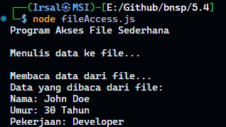

# Program Akses File Sederhana

Program ini adalah aplikasi sederhana untuk menulis dan membaca data dari file menggunakan **Node.js**.

## Fitur Program

1. **Menulis Data**:

    - Program akan menulis string data ke file bernama `data.txt`.

2. **Membaca Data**:

    - Program akan membaca isi file `data.txt` dan menampilkannya di terminal.

3. **File yang Digunakan**:
    - File `data.txt` akan dibuat atau diperbarui secara otomatis.

## Teknologi yang Digunakan

-   **Node.js**: Untuk mengakses sistem file (File System).

## Cara Menjalankan Program

1. **Prasyarat**:

    - Pastikan Node.js sudah terinstall di komputer Anda.

2. **Langkah Menjalankan**:

    - Salin kode program ke dalam file bernama `fileAccess.js`.
    - Jalankan program dengan perintah:

        ```bash
        node fileAccess.js
        ```

3. **Hasil**:
    - File `data.txt` akan dibuat di direktori yang sama dengan file program.
    - Program akan menampilkan isi file di terminal.

## Contoh Output

### Output di Terminal



### Isi File (`data.txt`)

```yaml
Nama: John Doe
Umur: 30 Tahun
Pekerjaan: Developer
```

## Pengembangan Lebih Lanjut

1. Tambahkan fitur untuk menambahkan data baru tanpa menimpa isi file (append).
2. Buat fungsi untuk menghapus file setelah data selesai diproses.
3. Gunakan input dari pengguna untuk data yang akan ditulis ke file.
